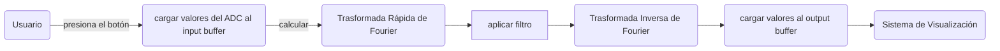
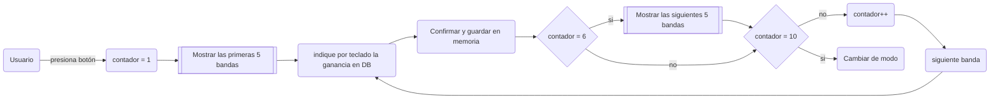
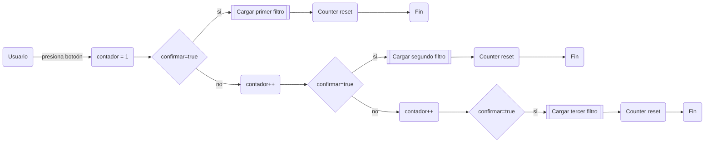

# Analizador de Espectro en Tiempo Real con LPC1769 (Cortex-M3)


Analizador de espectro, ecualizador y filtro de ruido. Consta de distintos modos de uso:

1. Modo de análisis de espectro en tiempo real con visualización en pantalla y aplicación de filtro guardado.
2. Modo de muestreo de ruido.
3. Modo de ecualización manual.
4. Modo de configuración: aplicar ecualización, filtro de ruido o passthrough.

El cambio de modos se realiza mediante un teclado matricial, así como la interacción en el modo de configuración.

>[!NOTE]
> - El teclado cambia su comportamiento en base al modo actual. 
> - [revisar]Si queremos modificar dinamicamente la configuración (Modo 4: Configuración) sin salir de la ejecución continua del tiempo real (Modo 1), se tiene que manejar la lógica en el handler del EINT seleccionado ? considerar que usamos la pantalla en ambos modos. 


<!-- Insertar gráficos -->


## Modo 1: Análisis de Espectro en Tiempo Real

1. Utilizando GPDMA se copian las muestras de señal del ADC a un doble buffer de procesamiento. El ADC está detras de un amplificador operacional, permitiendo captar sonido con un micrófono pasivo.
2. El procesador lee el último periodo de muestras del doble buffer y aplica la transformada rápida de Fourier (FFT).
3. En el espectro de frecuencias se aplica el filtro indicado por el puntero correspondiente.
4. Utilizando la transformada inversa de Fourier se obtiene la señal resultante y se copia a un buffer de salida.
5. Un segundo canal del GPDMA emite la señal a través del DAC. La salida del DAC se conecta a un aplificador operacional, permitiendo emitir la señal como sonido con una bocina pasiva.
6. En paralelo y a una frecuencia menor se visualiza el espectro de frecuencias resultante en una pantalla OLED conectada por I2C.



> [!NOTE]
> 
> 
> Decidir:
> 
> - Frecuencia de muestreo
> - Tamaño de la FFT
> - Utilización de memoria flash para almacenamiento?

## Modo 2: Modo de muestreo de ruido

1. Utilizando GPDMA se copian las muestras de señal del ADC a un doble buffer de procesamiento.
2. El procesador lee el último periodo de muestras del doble buffer y aplica la transformada rápida de Fourier (FFT).
3. El espectro de frecuencias del ruido se almacena como un filtro en la zona de memoria reservada para el filtro de ruido.
4. El inicio y finalización de la grabación se realiza mediante el teclado.


> [!NOTE]
> 
> 
> Decidir:
> 
> - Tomar promedio de la señal de ruido durante la grabación?

## Modo 3: Ecualización

1. El usuario manualmente define la atenuación o ganancia de cada banda de frecuencia en la pantalla OLED utilizando el teclado (en decibelios).
    
    1.1. Por cada banda puede atenuar como minimo -12 DB y amplificar como máxio 12 DB.
    
    1.2. Como el rango de frecuencias es de 0-16 kHz tomamos 10 bandas : 31.5 Hz – 63 Hz – 125 Hz – 250 Hz – 500 Hz – 1 kHz – 2 kHz – 4 kHz – 8 kHz – 16 kHz.
    
2. La configuración se guarda en la zona de memoria reservada para el filtro de ecualización.
3. [Sujeto a cambio] Se visualiza mediante un pantalla OLED conectada por I2C de las primero cinco bandas, al pasar de la quinta a la sexta banda la pantalla muestra las siguientes 5 bandas restantes.



> - Ancho de banda que vamos a usar Q = 1.414
> - Al amplificar una frecuencia, se aumentan las del entorno formando una campana. (Existen otras formas de ecualizar, tambián podriamos amplificar todos los valore desde cierto rango, tiene forma de meseta)
> 

## Modo 4: Configuración

1. Mediante el teclado el usuario selecciona el filtro a utilizar: el filtro a base del muestro de ruido realizado en modo 2, un filtro de ecualización definido por el usuario o passthrogh.
2. La selección de modo cambia la estructura de configuración del modo 1 apuntando a la zona de memoria correspondiente con los parámetros adecuados.



# Quickstart

## Requisitos

- [MCUXpresso IDE](https://www.nxp.com/design/design-center/software/development-software/mcuxpresso-software-and-tools-/mcuxpresso-integrated-development-environment-ide:MCUXpresso-IDE)
    - [Instalación en Arch Linux](https://gist.github.com/b-Tomas/0020459896914a7bc4183d71dc9441dd)
- Git

## Clonar el repositorio

```bash
git clone --recursive <https://github.com/b-Tomas/embedded-spectrum-analyzer.git>
cd embedded-spectrum-analyzer
```

O si ya se clonó sin `--recursive`, inicializar los submódulos manualmente:

```bash
git submodule update --init --recursive
```

## Workaround para Linux: symlink de headers

La biblioteca CMSIS usa `#include "LPC17xx.h"` pero algunos drivers incluyen `"lpc17xx.h"` (minúsculas). En sistemas case-sensitive como Linux, esto falla. Crear un symlink:

```bash
ln -s LPC17xx.h lib/CMSISv2p00_LPC17xx/CMSISv2p00_LPC17xx/inc/lpc17xx.h
```

## Importar proyectos en MCUXpresso

Click en *File* > *Import* > *General* > *Existing Projects into Workspace* > seleccionar la raiz del repositorio > Marcar la casilla *Search for nested projects* y verificar que tanto `firmware/` como `lib/CMSISv2p00_LPC17xx/CMSISv2p00_LPC17xx/` estén marcados > *Finish*

Deberían aparecer dos proyectos en el workspace: `spectrum-analyzer` y `CMSISv2p00_LPC17xx`.

## Configurar referencias del proyecto

1. Click derecho en `spectrum-analyzer` > *Properties* > *Project References*
2. Asegurar que esté marcada la casilla `CMSISv2p00_LPC17xx`
3. Aplicar y cerrar

Esto asegura que la biblioteca se compile antes que el firmware.

## Configuración para contributors

### Formatter (clang-format)

Activar el hook de pre-commit (una vez por clon):

```bash
git config core.hooksPath .githooks
```

Esto bloquea commits con formato incorrecto. Para corregir el formato automáticamente:

```bash
./scripts/check-format.sh fix
```

### LSP (clangd)

Generar la configuración de clangd para autocompletado e include paths (una vez por clon):

```bash
./scripts/setup-clangd.sh
```

Esto crea un `.clangd` con las paths absolutos.

### Integración con MCUXpresso

Para formatear desde el IDE, instalar el plugin [CppStyle](https://marketplace.eclipse.org/content/cppstyle):

1. *Help* > *Eclipse Marketplace* > buscar "CppStyle" > *Install*
2. *Window* > *Preferences* > *CppStyle* > configurar la ruta a `clang-format` (e.g. `/usr/bin/clang-format`)
3. *Window* > *Preferences* > *C/C++* > *Code Style* > *Formatter* > seleccionar **CppStyle (clang-format)** como formatter activo

El plugin usa el `.clang-format` del proyecto automáticamente. Formatear con `Ctrl+Shift+F` como cualquier otro formatter de Eclipse.

## Compilar

Si la referencia del proyecto está configurada correctamente, compilar `spectrum-analyzer` debería ser suficiente.

Caso contrario, puede ser necesario compilar `CMSISv2p00_LPC17xx` primero, y luego `spectrum-analyzer`:

1. Click derecho en `CMSISv2p00_LPC17xx` > Build Project
2. Click derecho en `spectrum-analyzer` > Build Project