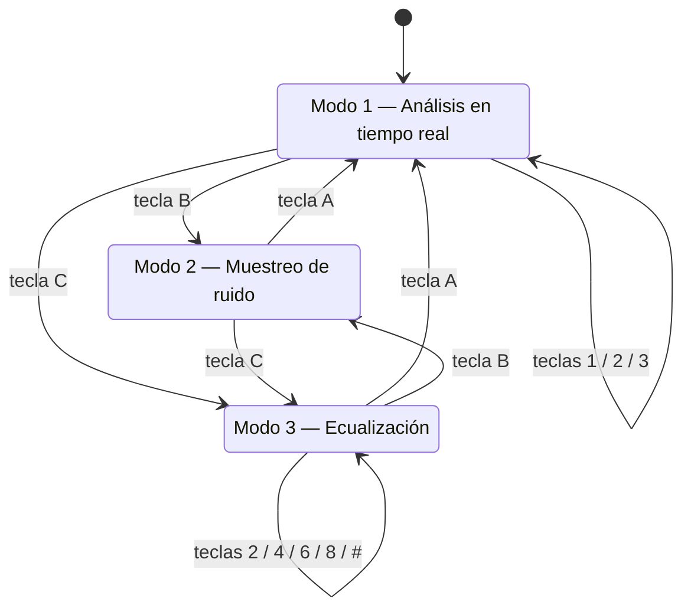
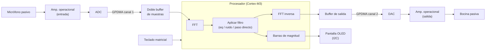
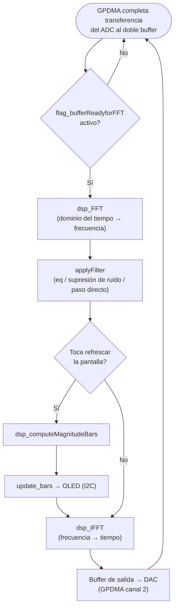
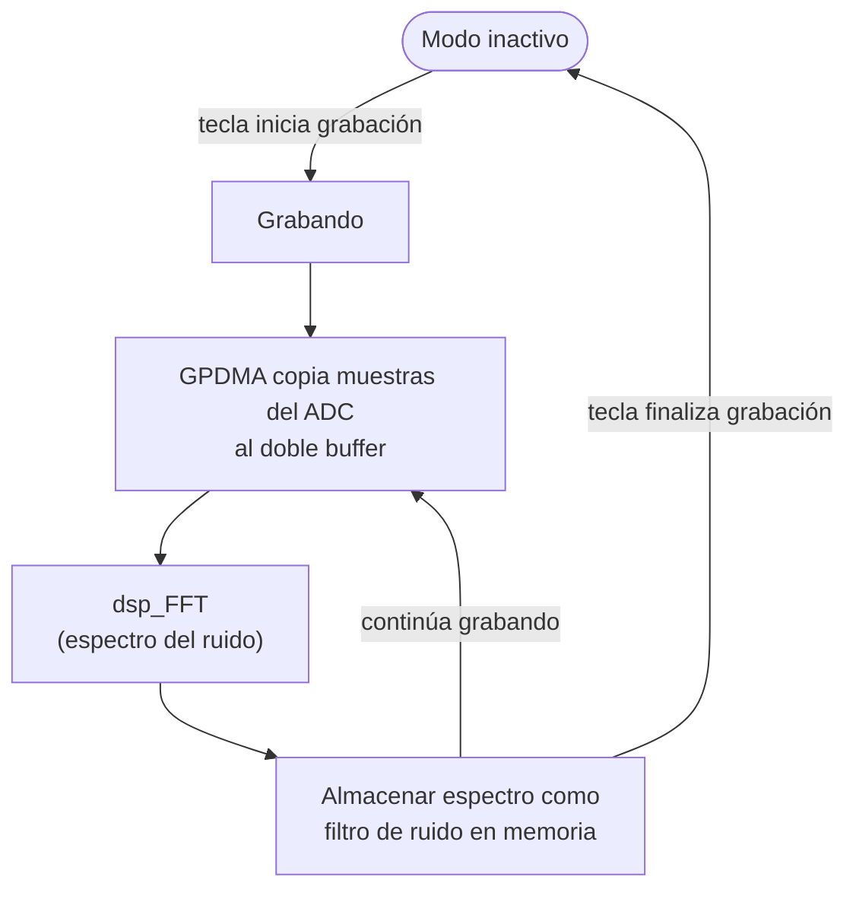
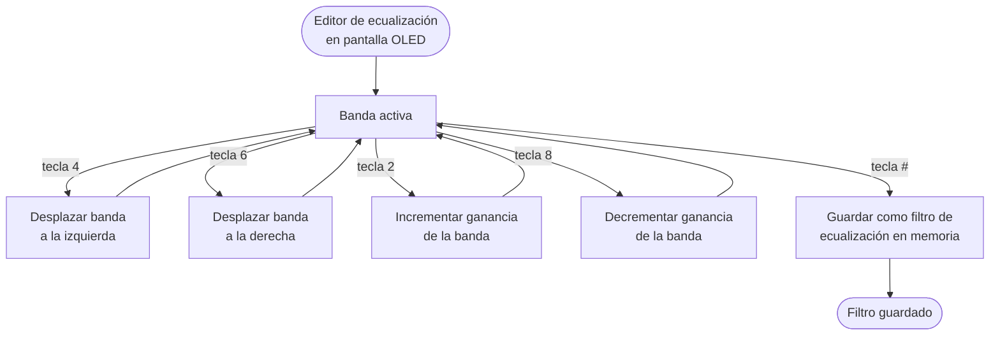

# Analizador de Espectro en Tiempo Real con LPC1769 (Cortex-M3)

[](README.md)

Analizador de espectro, ecualizador y filtro de ruido. Consta de distintos modos de uso:
1. Modo de análisis de espectro en tiempo real con visualización en pantalla y aplicación de filtro guardado.
2. Modo de muestreo de ruido.
3. Modo de ecualización manual.


El cambio de modos se realiza mediante un teclado matricial, así como la interacción en el modo de configuración.

```
      Layout
      | 1 | 2 | 3 | A |
      | 4 | 5 | 6 | B |
      | 7 | 8 | 9 | C |
      | * | 0 | # | D |
``` 


> [!NOTE]  
> **Comportamiento del global del teclado**:  
>   A: Cambia a Modo 1: Análisis del Espectro en Tiempo Real.  
>   B: Cambia a Modo 2: Muestreo de ruido.  
>   C: Cambia entre el Modo 3: Equalizador

### Máquina de estados de los modos

El cambio de modo es global: las teclas `A`, `B` y `C` desinicializan el modo
actual e inicializan el seleccionado (ver `system_handleKey` en
`firmware/src/system/system.c`).


```mermaid
stateDiagram-v2
    [*] --> Modo1
    Modo1: Modo 1 — Análisis en tiempo real
    Modo2: Modo 2 — Muestreo de ruido
    Modo3: Modo 3 — Ecualización

    Modo1 --> Modo2: tecla B
    Modo1 --> Modo3: tecla C
    Modo2 --> Modo1: tecla A
    Modo2 --> Modo3: tecla C
    Modo3 --> Modo1: tecla A
    Modo3 --> Modo2: tecla B

    Modo1 --> Modo1: teclas 1 / 2 / 3
    Modo3 --> Modo3: teclas 2 / 4 / 6 / 8 / #
```

### Arquitectura del sistema

Vista general del flujo de señal a través del hardware y el procesador. La
señal de audio se captura con un micrófono pasivo, se procesa en el dominio
de la frecuencia y se reproduce con una bocina pasiva, mientras el espectro se
visualiza en paralelo en la pantalla OLED.


```mermaid
flowchart LR
    Mic["Micrófono pasivo"] --> AmpIn["Amp. operacional<br/>(entrada)"]
    AmpIn --> ADC["ADC"]
    ADC -->|GPDMA canal 1| DBuf["Doble buffer<br/>de muestras"]

    subgraph CPU["Procesador (Cortex-M3)"]
        direction TB
        FFT["FFT"] --> Filtro["Aplicar filtro<br/>(eq / ruido / paso directo)"]
        Filtro --> IFFT["FFT inversa"]
        Filtro --> Barras["Barras de magnitud"]
    end

    DBuf --> FFT
    IFFT --> OutBuf["Buffer de salida"]
    OutBuf -->|GPDMA canal 2| DAC["DAC"]
    DAC --> AmpOut["Amp. operacional<br/>(salida)"]
    AmpOut --> Bocina["Bocina pasiva"]

    Barras --> OLED["Pantalla OLED<br/>(I2C)"]
    Teclado["Teclado matricial"] --> CPU
```

## Modo 1: Análisis de Espectro en Tiempo Real

1. Utilizando GPDMA se copian las muestras de señal del ADC a un doble buffer de procesamiento. El ADC está detras de un amplificador operacional, permitiendo captar sonido con un micrófono pasivo.
2. El procesador lee el último periodo de muestras del doble buffer y aplica la transformada rápida de Fourier (FFT).
3. En el espectro de frecuencias se aplica el filtro indicado por el puntero correspondiente.
4. Utilizando la transformada inversa de Fourier se obtiene la señal resultante y se copia a un buffer de salida.
5. Un segundo canal del GPDMA emite la señal a través del DAC. La salida del DAC se conecta a un aplificador operacional, permitiendo emitir la señal como sonido con una bocina pasiva.
6. En paralelo y a una frecuencia menor se visualiza el espectro de frecuencias resultante en una pantalla OLED conectada por I2C.

  El usuario manualmente establece el filtro a aplicar utilizando el teclado:  
  - `1`: Aplicar el filtro de ecualización.  
  - `2`: Aplicar filtro de supresión de ruido.  
  - `3`: Aplicar el filtro de paso directo.  

El procesamiento se ejecuta una vez por período de muestras. Cuando el GPDMA
completa una transferencia del ADC, marca `flag_bufferReadyforFFT` y el bucle
principal lo consume (ver `tick()` en `firmware/src/system/real_time_mode.c`):


```mermaid
flowchart TD
    Start(["GPDMA completa transferencia<br/>del ADC al doble buffer"]) --> Flag{"flag_bufferReadyforFFT<br/>activo?"}
    Flag -->|No| Start
    Flag -->|Sí| FFT["dsp_FFT<br/>(dominio del tiempo → frecuencia)"]
    FFT --> Filtro["applyFilter<br/>(eq / supresión de ruido / paso directo)"]
    Filtro --> Disp{"Toca refrescar<br/>la pantalla?"}
    Disp -->|Sí| Bars["dsp_computeMagnitudeBars"]
    Bars --> OLED["update_bars → OLED (I2C)"]
    OLED --> IFFT
    Disp -->|No| IFFT["dsp_IFFT<br/>(frecuencia → tiempo)"]
    IFFT --> Out["Buffer de salida → DAC<br/>(GPDMA canal 2)"]
    Out --> Start
```

La visualización de la pantalla ocurre a una frecuencia menor que el
procesamiento de audio, por eso el refresco del OLED es condicional dentro del
mismo bucle.

El siguiente diagrama de secuencia muestra la naturaleza concurrente y guiada
por interrupciones del modo: el GPDMA llena el doble buffer de forma autónoma,
la ISR del DMA y la ISR del Timer1 activan sus respectivos flags, y el bucle
principal (`main` en `firmware/src/spectrum-analyzer.c`, que despierta con
`__WFI`) los consume.

```mermaid
sequenceDiagram
    participant DMA as ADC + GPDMA (CH7)
    participant ISRD as ISR DMA
    participant ISRT as ISR Timer1
    participant Loop as Bucle principal
    participant DSP as DSP
    participant Out as DAC / OLED

    Note over DMA: Llena una mitad del doble buffer<br/>(ping-pong autónomo)
    DMA->>ISRD: Terminal count (DMA_IRQ)
    ISRD->>ISRD: Alterna flag_halfReady
    ISRD-->>Loop: flag_bufferReadyforFFT = SET
    Note over DMA: Sigue llenando la otra mitad en paralelo

    ISRT-->>Loop: flag_readyToDisplay = SET (menor frecuencia)

    Loop->>Loop: Despierta de __WFI, ve flag_bufferReadyforFFT
    Loop->>DSP: dsp_FFT + applyFilter
    alt flag_readyToDisplay activo
        DSP->>Out: dsp_computeMagnitudeBars → OLED (I2C)
    end
    Loop->>DSP: dsp_IFFT
    DSP->>Out: Buffer de salida → DAC (GPDMA canal 2)
```
### Mapeo de frecuencias del display

La entrada al ADC es una señal **real** (no compleja). La FFT produce un espectro simétrico:
los bins `512..1023` son el espejo conjugado de los bins `511..0`.
Por eso solo se usan los **primeros 512 bins** (0 a 511) para construir las barras.

| Concepto | Valor |
|----------|-------|
| Frecuencia de muestreo (`ADC_RATE`) | 32768 Hz |
| Tamaño de FFT (`PERIOD`) | 1024 |
| Resolución espectral | 32768 / 1024 = **32 Hz/bin** |
| Bins únicos usados | 512 (bins 0..511) |
| Barras en pantalla (`N_BARS`) | 128 |
| Bins por barra | 512 / 128 = **4** |
| Ancho de banda por barra | 4 × 32 Hz = **128 Hz** |

Cada barra `k` (0 a 127) cubre el rango `[k × 128, (k+1) × 128)` Hz.
La frecuencia central aproximada es `k × 128 + 64` Hz.

| Barra | Rango de frecuencia |
|:-----:|---------------------|
| 0 | 0 – 128 Hz |
| 8 | 1,0 – 1,1 kHz |
| 16 | 2,0 – 2,2 kHz |
| 32 | 4,1 – 4,2 kHz |
| 64 | 8,2 – 8,3 kHz |
| 127 | 16,3 – 16,4 kHz (Nyquist) |  


## Modo 2: Modo de muestreo de ruido

1. Utilizando GPDMA se copian las muestras de señal del ADC a un doble buffer de procesamiento.
2. El procesador lee el último periodo de muestras del doble buffer y aplica la transformada rápida de Fourier (FFT).
3. El espectro de frecuencias del ruido se almacena como un filtro en la zona de memoria reservada para el filtro de ruido.
4. El inicio y finalización de la grabación se realiza mediante el teclado.


```mermaid
flowchart TD
    Idle(["Modo inactivo"]) -->|tecla inicia grabación| Rec["Grabando"]
    Rec --> Capt["GPDMA copia muestras del ADC<br/>al doble buffer"]
    Capt --> FFT["dsp_FFT<br/>(espectro del ruido)"]
    FFT --> Store["Almacenar espectro como<br/>filtro de ruido en memoria"]
    Store -->|tecla finaliza grabación| Idle
    Store -->|continúa grabando| Capt
```

> [!NOTE]
>
> Decidir:
> - Tomar promedio de la señal de ruido durante la grabación?

## Modo 3: Ecualización

1. El usuario manualmente define la atenuación o ganancia de cada banda de frecuencia en la pantalla OLED utilizando el teclado:
  - `4`: desplazar banda activa a la izquierda
  - `6`: desplazar banda activa a la derecha
  - `2`: incrementar el valor de la banda activa
  - `8`: decrementar el valor de la banda activa
  - `#`: guardar los cambios como filtro

2. La configuración se guarda en la zona de memoria reservada para el filtro de ecualización.


```mermaid
flowchart TD
    Start(["Editor de ecualización<br/>en pantalla OLED"]) --> Sel["Banda activa"]
    Sel -->|tecla 4| Left["Desplazar banda<br/>a la izquierda"]
    Sel -->|tecla 6| Right["Desplazar banda<br/>a la derecha"]
    Sel -->|tecla 2| Up["Incrementar ganancia<br/>de la banda"]
    Sel -->|tecla 8| Down["Decrementar ganancia<br/>de la banda"]
    Left --> Sel
    Right --> Sel
    Up --> Sel
    Down --> Sel
    Sel -->|tecla #| Save["Guardar como filtro de<br/>ecualización en memoria"]
    Save --> End(["Filtro guardado"])
```

> [!NOTE]
>  
> Las bandas son:  
> `0-125` `125-250` `250-500` `500-1k` `1k-2k` `2k-4k` `4k-8k` `8k-16k` [Hz] (TODO: confirm)
> 
> Cada decremento en las bandas representa una atenuación de X dB (TODO: confirm)

## Requisitos

- [MCUXpresso IDE](https://www.nxp.com/design/design-center/software/development-software/mcuxpresso-software-and-tools-/mcuxpresso-integrated-development-environment-ide:MCUXpresso-IDE)
  - [Instalación en Arch Linux](https://gist.github.com/b-Tomas/0020459896914a7bc4183d71dc9441dd)
- Git

## Clonar el repositorio

```bash
git clone --recursive https://github.com/b-Tomas/embedded-spectrum-analyzer.git
cd embedded-spectrum-analyzer
```

O si ya se clonó sin `--recursive`, inicializar los submódulos manualmente:

```bash
git submodule update --init --recursive
```

## Workaround para Linux: symlink de headers

La biblioteca CMSIS usa `#include "LPC17xx.h"` pero algunos drivers incluyen `"lpc17xx.h"` (minúsculas). En sistemas case-sensitive como Linux, esto falla. Crear un symlink:

```bash
ln -s LPC17xx.h lib/CMSISv2p00_LPC17xx/CMSISv2p00_LPC17xx/inc/lpc17xx.h
```

## Importar proyectos en MCUXpresso

Click en *File* > *Import* > *General* > *Existing Projects into Workspace* > seleccionar la raiz del repositorio > Marcar la casilla *Search for nested projects* y verificar que tanto `firmware/` como `lib/CMSISv2p00_LPC17xx/CMSISv2p00_LPC17xx/` estén marcados > *Finish*

Deberían aparecer dos proyectos en el workspace: `spectrum-analyzer` y `CMSISv2p00_LPC17xx`.

## Configurar referencias del proyecto

1. Click derecho en `spectrum-analyzer` > *Properties* > *Project References*
2. Asegurar que esté marcada la casilla `CMSISv2p00_LPC17xx`
3. Aplicar y cerrar

Esto asegura que la biblioteca se compile antes que el firmware.

## Configuración para contributors

### Formatter (clang-format)

Activar el hook de pre-commit (una vez por clon):

```bash
git config core.hooksPath .githooks
```

Esto bloquea commits con formato incorrecto. Para corregir el formato automáticamente:

```bash
./scripts/check-format.sh fix
```

### LSP (clangd)

Generar la configuración de clangd para autocompletado e include paths (una vez por clon):

```bash
./scripts/setup-clangd.sh
```

Esto crea un `.clangd` con las paths absolutos.

### Integración con MCUXpresso

Para formatear desde el IDE, instalar el plugin [CppStyle](https://marketplace.eclipse.org/content/cppstyle):

1. *Help* > *Eclipse Marketplace* > buscar "CppStyle" > *Install*
2. *Window* > *Preferences* > *CppStyle* > configurar la ruta a `clang-format` (e.g. `/usr/bin/clang-format`)
3. *Window* > *Preferences* > *C/C++* > *Code Style* > *Formatter* > seleccionar **CppStyle (clang-format)** como formatter activo

El plugin usa el `.clang-format` del proyecto automáticamente. Formatear con `Ctrl+Shift+F` como cualquier otro formatter de Eclipse.

## Compilar

Si la referencia del proyecto está configurada correctamente, compilar `spectrum-analyzer` debería ser suficiente.

Caso contrario, puede ser necesario compilar `CMSISv2p00_LPC17xx` primero, y luego `spectrum-analyzer`:
1. Click derecho en `CMSISv2p00_LPC17xx` > Build Project
2. Click derecho en `spectrum-analyzer` > Build Project
